# BalancedaorAWS
# Índice
[Introducción.](#introducción)

[Configuración.](#configuración)

[Solucion errores en el proceso.](#Solucionerrores)
# Introducción
# Configuración

### Configuración de VPC

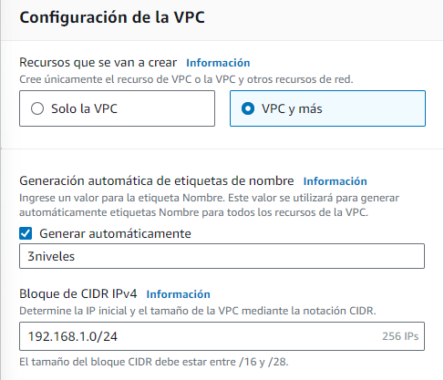

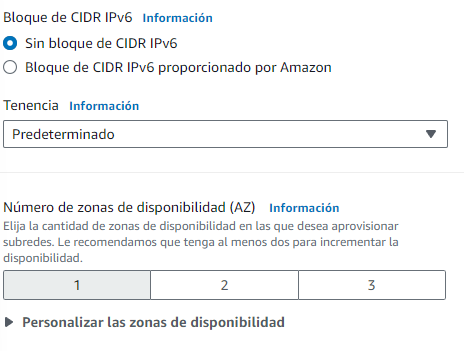

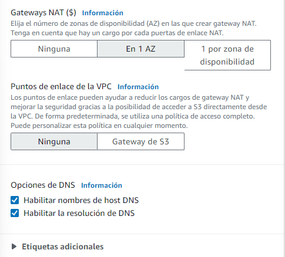


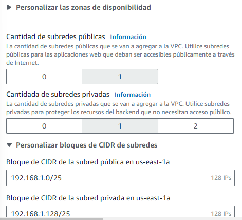


### Balanceador
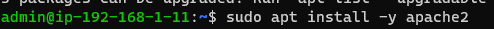


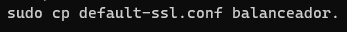


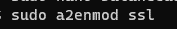


### Maquinas Backend
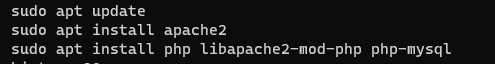

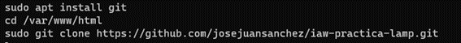

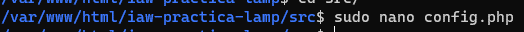

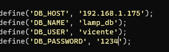

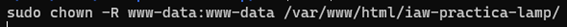


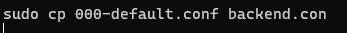


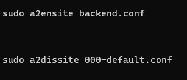


### Servidor GGBB


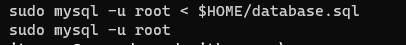
## Certificado


## Solucion errores en el proceso

# Error del puerto 80 al crear el certificado
#### Al crear el certificado me a dado un fallo del puerto 80 para solucionarlo se debe crear un fichero en sites-available y habilitarlo con sudo a2ensite "fichero".conf.
# A la hora de conectar de una maquina a otra
### deberás dar los siguientes permisos:
```
sudo chmod 400 clave.pem
```
### A continuacion pasaremos la clave de una maquina a otra con el siguiente comando:
```
scp -i "clave.pem" clave.pem admin@192.168.1.240:/home/admin
```
### Una vez realizado podremos conectar con la otra maquina
```
ssh -i "clave.pem" admin@192.168.1.240
```

