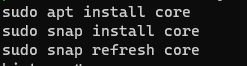
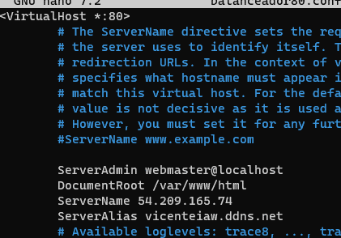

# BalancedaorAWS
# Índice
# Introducción
# Configuración

## Certificado

Al crear el certificado me a dado un fallo del puerto 80 para solucionarlo se debe crear un fichero en sites-available

Con la configuración mostrada y habilitarlo con sudo a2ensite balanceador80.conf.
