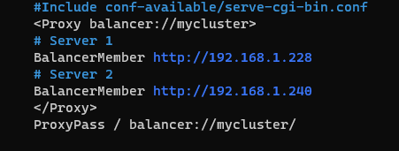

# BalancedaorAWS


# Índice
1. [Introducción.](#introducción)

2. [Configuración de instacias.](#configuración)

    * [Creacion de VPC.](#VPC)
    * [Servidor Balanceador.](#Balanceador)
    * [Servidores Backend.](#Backends)
    * [Servidor de base de datos.](#GGBB)

3. [Solucion de errores en el proceso.](#Errores)

# Introducción

En el siguiente manual, realizaremos una configuración en 3 niveles que constará de los siguientes apartados:

* Un balanceador en la capa 1 expuesto a red pública.
* Dos servidores web en el backend, capa 2 (red privada).
* Un servidor de base de datos en la capa 3 (red privada).

Esta estructura realizada en AWS (Amazon Web Services).

# Configuración

### VPC
Para la VPC, seleccionaremos la opción de "VPC y más", ya que esto nos permitirá crear todo lo necesario para que esté en funcionamiento directamente. De otra forma, tendríamos que crear cada parte de la VPC de forma individual y podría ocasionar algún problema.

Comenzarás dando un nombre a esta y seleccionando la dirección de red que queramos para la arquitectura a desarrollar.


A continuación, dejaremos las siguientes opciones por defecto y el número de zonas lo seleccionaremos como uno.


Para las gateways seleccionamos una y los puntos de enlace los dejaremos en ninguno.


Para las subredes, seleccionaremos una pública y una privada. En el apartado de bloques CIDR, dividiremos la subred en dos subredes de 128 IPs.


Con esta configuración, daremos por finalizada la creación de la VPC y comenzaremos con la configuración de las instancias.

### Balanceador
Para la creación del balanceador, instalaremos Apache. Para ello, ejecutaremos los siguientes comandos:

```
sudo apt update
sudo apt install -y apache2
```

Una vez que se haya activado, copiaremos el archivo **default-ssl.conf** y le daremos un nombre para identificarlo más tarde. Todo esto lo debemos realizar en el mismo directorio /etc/apache2/sites-available.


Una vez instalado el servicio Apache, activaremos los siguientes módulos:

```
a2enmod proxy
a2enmod proxy_http
a2enmod proxy_ajp
a2enmod rewrite
a2enmod deflate
a2enmod headers
a2enmod proxy_balancer
a2enmod proxy_connect
a2enmod proxy_html
a2enmod lbmethod_byrequests
```


Ahora editaremos el archivo copiado anteriormente con las siguientes líneas, además de comentar la línea documentroot.





Activaremos el sitio con el comando a2ensite **balanceador.conf** y deshabilitaremos el archivo **000-default.conf**
```
sudo a2ensite balanceador.conf
```

```
sudo a2dissite 000-default.conf
```


Para finalizar la configuración del balanceador, activaremos el módulo SSL con sudo a2enmod ssl y aplicaremos los cambios reiniciando el servicio Apache2.
```
sudo a2enmod ssl
```


```
sudo systemctl restart apache2
```


### Backends
Para las instancias backend se realizarán las mismas configuraciones en ambas.
Se comenzará instalando Apache y PHP
```
sudo apt update
sudo apt install -y apache2
sudo apt install php libapache2-mod-php php-mysql
```


Seguidamente, nos bajaremos el repositorio de GitHub para editar el archivo de acceso a la base de datos. Esta descarga la realizaremos en el directorio /var/www/html.

```
sudo apt install -y git
sudo mkdir /var/www/html
sudo git clone https://github.com/josejuansanchez/iaw-practica-lamp.git 
```


Accederemos al archivo **config.php** y lo editaremos de la siguiente manera:
```
sudo nano /var/www/html/iaw-practica-lamp/src/config.php
```


Ahora se le editarán los permisos.
```
sudo chown -R www-data:www-data /var/www/html/iaw-practica-lamp
```


Lo siguiente será copiar el archivo **000-default.conf** y lo editaremos.
```
cd /etc/apache2/sites-available
sudo cp 000-default.con backend.conf
```


En este archivo editaremos la línea **DocumentRoot** para acceder a la página de la base de datos.


Después se habilitará el archivo **backend.conf** y se deshabilitará el **archivo 000-default.conf**
```
sudo a2ensite backend.conf
sudo a2dissite 000-default.conf
```


Ahora se reinicia Apache2 para ejecutar los cambios y pasaremos el archivo **database.sql** a la máquina de base de datos.
```
sudo systemctl restart apache2
```


### GGBB
Para configurar el servidor de base de datos, instalaremos mariadb-server
```
sudo apt update
sudo apt install mariadb-server
```


En el siguiente archivo, se editará la línea **bind-address** con la dirección IP del servidor.


Lo siguiente que se debe realizar es crear un usuario para la base de datos, la base de datos y dar privilegios al usuario sobre esa base de datos. Para ello, usaremos los siguientes comandos:

Para conectar a la base de datos, usaremos *mysql -u root -p*

Para crear el usuario, usaremos *create user 'vicente'@'X.X.X.X' identified by '1234';*

Para los privilegios del usuario, usaremos *grant all privileges on lam_db.* to vicente@X.X.X.X;*

Para aplicar los privilegios, usaremos *flush privileges;*

Lo siguiente será conectar la base de datos con el siguiente comando:
```
sudo mysql -u root < $home/database.sql
```


## Certificado
Para certificar el sitio web, instalaremos snapd.
```sudo apt install snapd ``` 


Una vez instalado, se ejecutará el siguiente comando: ```sudo snap install --classic certbot```


## Errores

# Error del puerto 80 al crear el certificado
#### Al crear el certificado me a dado un fallo del puerto 80 para solucionarlo se debe crear un fichero en sites-available y habilitarlo con sudo a2ensite "fichero".conf.
# A la hora de conectar de una maquina a otra
### deberás dar los siguientes permisos:
```
sudo chmod 400 clave.pem
```
### A continuacion pasaremos la clave de una maquina a otra con el siguiente comando:
```
scp -i "clave.pem" clave.pem admin@192.168.1.240:/home/admin
```
### Una vez realizado podremos conectar con la otra maquina
```
ssh -i "clave.pem" admin@192.168.1.240
```

