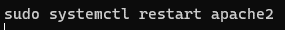
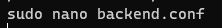
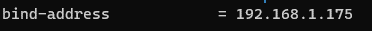

# BalancedaorAWS


# Índice
[Introducción.](#introducción)

[Configuración.](#configuración)

[Solucion de errores en el proceso.](#Errores)

# Introducción
En el siguiente manual realizaremos una configuración en 3 niveles que constara e los siguientes apartados:

* Un balanceador en capa 1 expuesta a red pública.

* Dos servidor web en Backend, capa 2 (red privada).

* Un servidor de BBDD en capa 3 (red privada).

# Configuración

### Configuración de VPC
Para la VPC escogeremos la opción de VPC y mas por que esta nos permitirá crear todo lo necesario para que este en funcionamiento directamente, de la otra forma habría que crear ca da parte de la VPC de forma individual y podría ocasionar algún problema.

Comenzaras poniendo un nombre a esta y seleccionando la dirección de red que queramos para la arquitectura a desarrollar.


A continuación dejaremos las siguiente opción por defecto y el número de zonas escogeremos solo una.


Para las gateway seleccionamos una y los puntos de enlace los dejaremos en ninguno.


Para las subredes se seleccionará una publica y una privada.
En el apartado de bloques CIDR dividiremos la subred en dos subredes de 128 IPs.


Con esta configuración se dará por finalizada la creación de la VPC y comenzaremos con la configuración de las instancias.

### Balanceador
Para la creacion del balanceador instalaremos Apache para ello se ejecutaran los siguentes comandos:

```
sudo apt update
sudo apt install -y apache2
```

Una vez se hayan activado se copiara el fichero default-ssl.conf y le daremos un nombre para identificarlo mas tarde. Todo esto lo debemos realizar en el mismo directorio **/etc/apache2/sites-available**


una vez instalado el servicio apache activaremos los siguientes modulos

```
a2enmod proxy
a2enmod proxy_http
a2enmod proxy_ajp
a2enmod rewrite
a2enmod deflate
a2enmod headers
a2enmod proxy_balancer
a2enmod proxy_connect
a2enmod proxy_html
a2enmod lbmethod_byrequests
```


ahora se editara el fichero copiado anterior mente con las siguentes lineas ademas de que se debe comentar la linea documetroot


Activaremos el sitio con el comando a2ensite **balanceador.conf** y desabilitaremos el fichero **000-default.conf**
```
sudo a2ensite balanceador.conf
```

```
sudo a2dissite 000-default.conf
```


Para finalizar el balanceador se activara el modulo SSH con sudo a2ensite ssl y aplicaremos los cambios reiniciando el servicio Apache2.
```
sudo a2enmod ssl
```


```
sudo systemctl restart apache2
```

### Maquinas Backend





### Servidor GGBB





## Certificado
Para certificar el sitio web  instalaremos snapd
```sudo apt install snapd ``` 


Una vez instalado se ejecutara al orden ```sudo snap install --classic certbot```


## Errores

# Error del puerto 80 al crear el certificado
#### Al crear el certificado me a dado un fallo del puerto 80 para solucionarlo se debe crear un fichero en sites-available y habilitarlo con sudo a2ensite "fichero".conf.
# A la hora de conectar de una maquina a otra
### deberás dar los siguientes permisos:
```
sudo chmod 400 clave.pem
```
### A continuacion pasaremos la clave de una maquina a otra con el siguiente comando:
```
scp -i "clave.pem" clave.pem admin@192.168.1.240:/home/admin
```
### Una vez realizado podremos conectar con la otra maquina
```
ssh -i "clave.pem" admin@192.168.1.240
```

